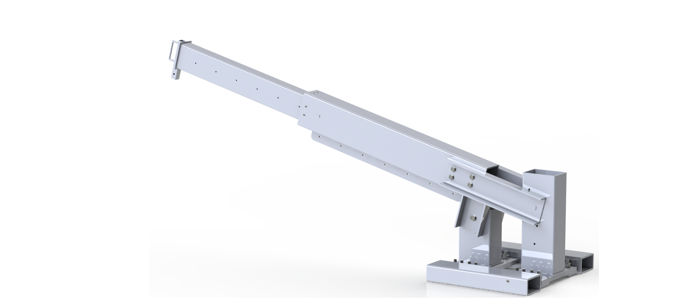
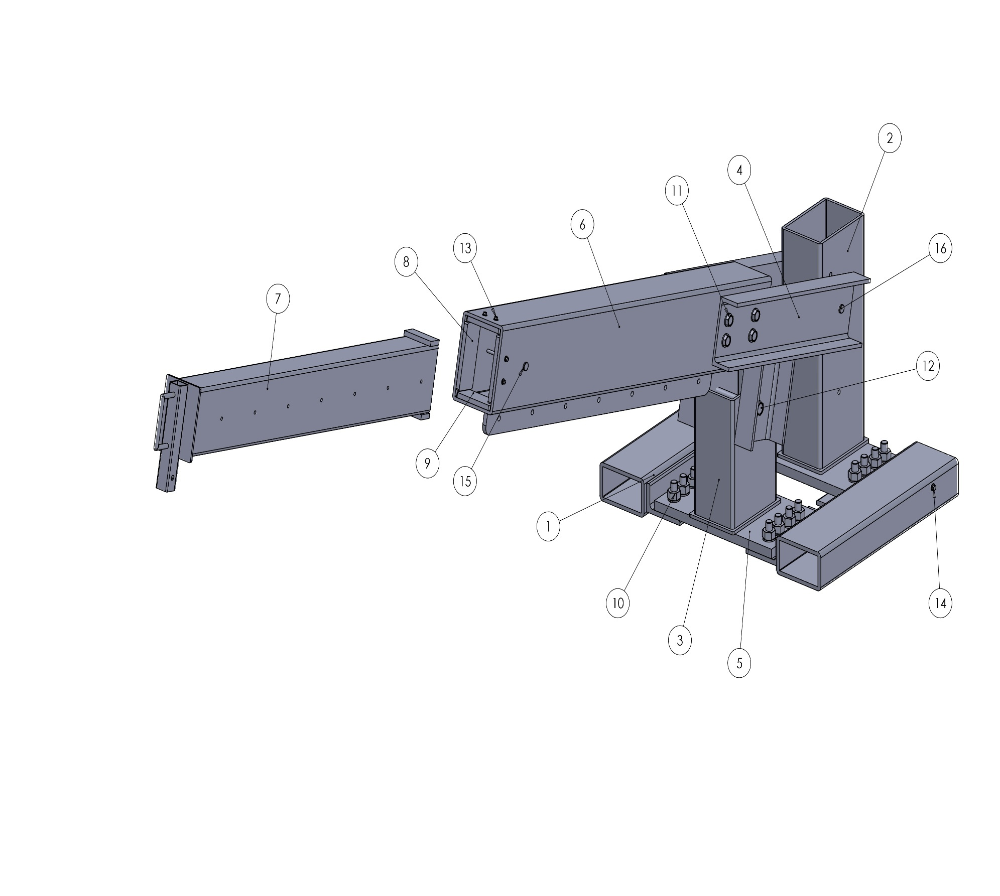
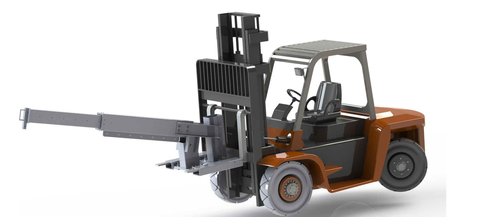

# Forklift Crane Attachment

Design and analysis of an adjustable crane attachment for a forklift, including structural calculations, mechanical joints, manufacturing drawings, and a complete SolidWorks assembly.

## Authors

* Ali Sakhaei
* Mohammadreza Sotude

## Project Overview

This academic machine-design project develops a removable crane attachment for a 3-ton forklift. The mechanism provides adjustable reach and boom angle while remaining fully demountable and manually adjustable.

The project covers forklift stability, static loading, structural members, bolts, pins, welds, component selection, CAD modeling, engineering drawings, and assembly documentation.

## Design Requirements

| Requirement                                  |                   Value |
| -------------------------------------------- | ----------------------: |
| Forklift capacity                            |                3 tonnes |
| Fork length                                  |                 1000 mm |
| Fork cross-section                           |             120 × 40 mm |
| Fork spacing                                 | 800 mm center-to-center |
| Maximum hook reach beyond fork tips          |                 2500 mm |
| Boom angles                                  |   0°, 15°, 30°, and 45° |
| Hook-position increments                     |                  200 mm |
| Required forklift stability factor of safety |                     1.5 |
| Adjustment method                            |                  Manual |
| Installation                                 |         Fully removable |

## Key Design Features

* Telescopic boom for adjustable lifting reach
* Multiple predefined boom-angle positions
* Hook locations arranged at 200 mm intervals
* Removable connection to the forklift forks
* Bolted, pinned, and welded mechanical joints
* Structural calculations for the main load-carrying components
* Complete SolidWorks parts, assemblies, and engineering drawings

## Design and Analysis

The design process included:

* Forklift stability evaluation at different boom configurations
* Static load analysis of the boom and supporting structure
* Selection and verification of bolts and clevis pins
* Weld sizing and connection assessment
* Evaluation of rectangular hollow sections, plates, channels, and angles
* Preparation of a bill of materials and manufacturing drawings
* Assembly modeling and interference checking in SolidWorks

## CAD Model





### Installation Context



The forklift vehicle shown above is a pre-existing reference model used only to demonstrate the installation context. It is not included in this repository and is not presented as original work.

## Main Structural Components

| Component                | Specification                                  |
| ------------------------ | ---------------------------------------------- |
| Outer boom               | 260 × 180 × 10 mm rectangular hollow section   |
| Inner extension          | 200 × 120 × 8 mm rectangular hollow section    |
| Base profile             | 200 × 120 × 12.5 mm rectangular hollow section |
| Support channel          | UAP 200, 2100 mm long                          |
| Main high-strength plate | StE500, 570 × 530 × 30 mm                      |
| General plates           | St37 steel                                     |
| Structural angle         | L 150 × 90 × 15 mm                             |
| Main fasteners           | M24 and M20 grade 8.8 bolts                    |
| Lifting hardware         | Grade 80 hook and shackle                      |

## Repository Contents

```text
.
├── docs/
│   └── forklift-crane-attachment-report-en.pdf
├── images/
│   ├── attachment-on-forklift-render.png
│   ├── crane-attachment-cad.jpg
│   └── crane-attachment-render.png
├── solidworks/
│   ├── parts and subassemblies
│   ├── main assembly
│   └── engineering drawings
└── README.md
```

## Project Report

[View the English project report](docs/forklift-crane-attachment-report-en.pdf)

## Software

* SolidWorks
* Microsoft Excel
* Engineering calculation and documentation tools

## Limitations and Safety

This repository presents an academic design. The attachment has not been fabricated, proof-load tested, certified, or approved for lifting operations.

Any real-world implementation would require verified material certificates, code-based lifting-device calculations, fatigue and buckling checks, qualified welding procedures, physical testing, inspection requirements, manufacturer approval, and review by a qualified engineer.
